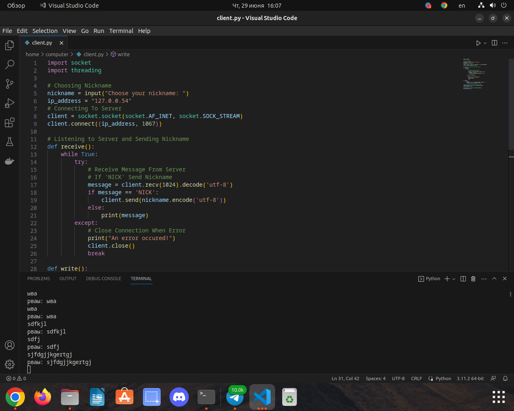
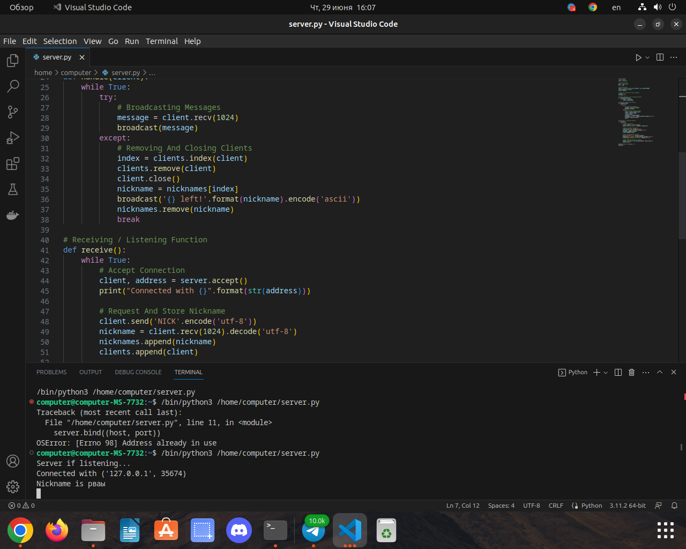
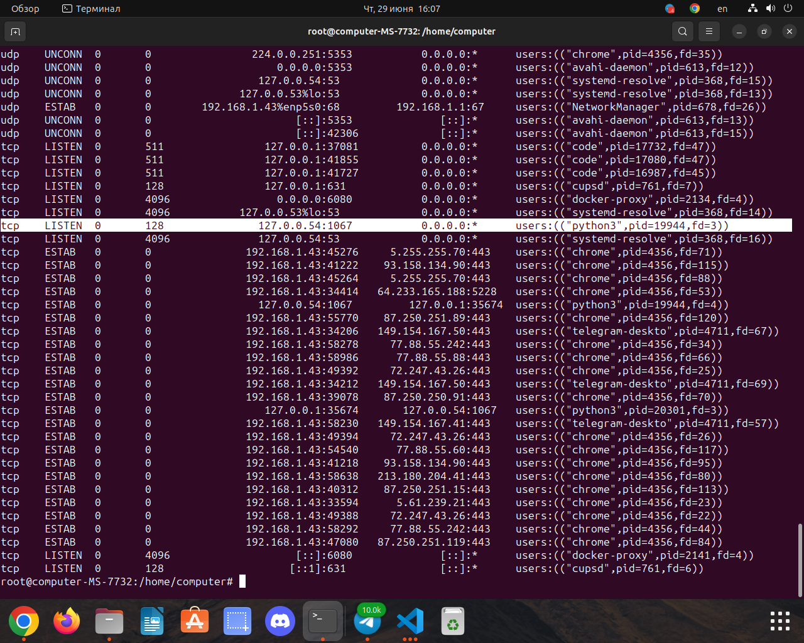

### Скрин терминала на стороне клиента

### Скрин терминала на стороне сервера

### Скрин терминала Linux

## Улучшения в коде
- Заменили ASCII на UTF - 8 теперь код работает с кирилицей
- Добавили комментарии на русском к коду 